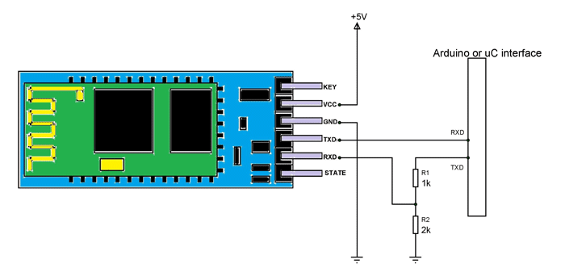

# HC-06-AT-Command-Setup
A simple arduino sketch using software serial library to test and set up HC-06 Bluetooth module via AT commands.
List of all available AT commands when using HC-06 Bluetooth module listed within sketch.

Circuit connections:

